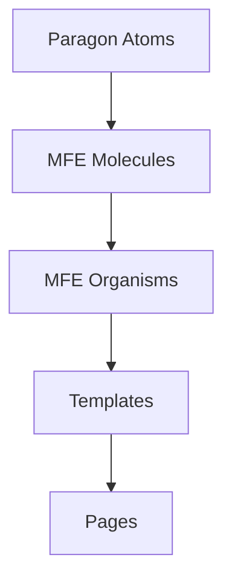

# Style Guide

This guide establishes the voice, tone, and conventions for all writing in this repository: product vision, proposals, documentation, and ADRs.

## Tone

We write with confidence, opinion, and an inviting tone. We are not neutral—we have a clear point of view about how the Open edX design system should evolve. At the same time, we welcome challenge and iteration.

- **Confident:** State decisions and reasoning clearly. Avoid hedging language ("maybe," "might," "could"). Use active voice.
- **Opinionated:** Cite tradeoffs explicitly. Explain why we chose one approach over alternatives.
- **Inviting:** Acknowledge the community; use "we" to include the broader Open edX ecosystem. Make it easy for others to contribute.

## Citation and Grounding

Always cite real repositories and file paths when referencing code. Readers should be able to click or grep directly.

**Good:**
> The `Button` component lives in [openedx/paragon](https://github.com/openedx/paragon) at `src/Button/Button.tsx`.

**Avoid:**
> The Button component is in Paragon.

Use full GitHub URLs for repos: `https://github.com/openedx/frontend-app-learning`.

## Diagrams and Visuals

Use Mermaid syntax for diagrams. Examples:



Diagrams should be self-explanatory and labeled clearly.

## Pronouns for Institutional Voice

- Use **"we"** when speaking on behalf of the Open edX community or the design system itself.
  - Example: "We define atoms as the indivisible building blocks."
- Use **"Schema"** when attributing decisions or stewardship to Schema Education specifically.
  - Example: "Schema leads governance of the design system."
- Use **"you"** sparingly and only in direct instructions (e.g., contributor guides).

## Language and Clarity

- **Active voice:** Prefer "The component exports a Button" over "A Button is exported by the component."
- **Concrete examples:** Ground abstract concepts in real Open edX code. Name specific files, repos, and functions.
- **No marketing fluff:** Avoid phrases like "cutting-edge," "next-generation," or "revolutionary." Describe what something *does*, not how it *feels*.
- **No buzzwords without grounding:** If you use a term like "composability" or "interoperability," explain what it means in the Open edX context.

## Section Headers

Use clear, descriptive headers that reflect content structure. Capitalize the first word and proper nouns.

```markdown
# Main Title
## Major Section
### Subsection
```

## Lists and Formatting

- Use bullet lists for unordered items; numbered lists for sequences.
- Use bold (**term**) for emphasis and definitions.
- Use code formatting (`code`) for variable names, file paths, component names, and technical identifiers.
- Use blockquotes (`>`) sparingly for callouts or important statements.

## Links

Inline links should use descriptive anchor text, not bare URLs:

**Good:**
> See the [Atomic Design Taxonomy](./atomic-design-taxonomy.md) for level definitions.

**Avoid:**
> See ./atomic-design-taxonomy.md for level definitions.

Use relative links within the repo (e.g., `./atomic-design-taxonomy.md`, `../proposals/0001-example.md`). Use full GitHub URLs for external repos.

## Code Examples

When including code snippets, use triple backticks with a language identifier:

```typescript
export const Button: React.FC<ButtonProps> = ({ label, onClick }) => (
  <button onClick={onClick}>{label}</button>
);
```

Keep examples concise. For long examples, reference the actual file path instead of including the full snippet.

## Date and Version Formats

- Dates: ISO 8601 format (YYYY-MM-DD). Example: 2026-05-19.
- Versions: Semantic versioning (MAJOR.MINOR.PATCH). Example: 1.2.0.
- ADR numbering: Zero-padded four digits (0001, 0002, etc.).

## Metadata and Frontmatter

MDX files may include YAML frontmatter for metadata:

```yaml
---
title: "Component Name"
atomicLevel: "molecule"
status: "stable"
lastUpdated: 2026-05-19
---
```

## Questions?

For questions about voice, tone, or conventions, open a discussion or issue. We iterate on this guide as the project evolves.
