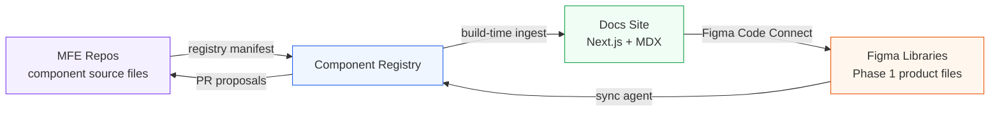
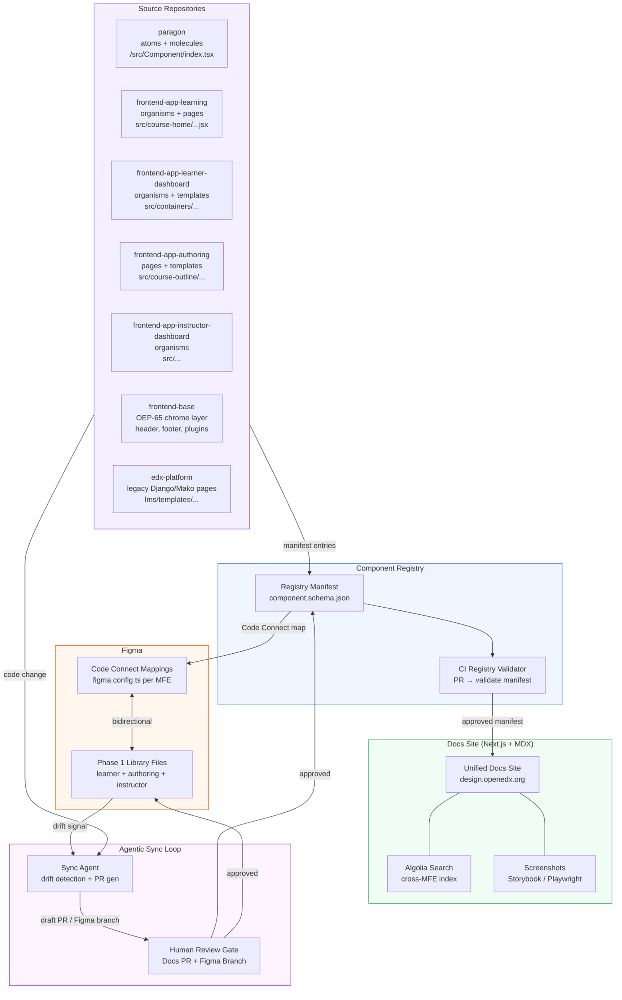

# Open edX Design System — Product Vision

> **Agentic v1 working document.** This vision was drafted as a starting point synthesized from early conversations between Schema Education and Axim Collaborative. It is posted in draft form so Schema, Axim, Open edX providers, and the wider community can revise, challenge, or extend the reframings and architecture below. Treat any specific framing here as a proposal open to revision, not a settled position. Authorship and ratification of the ideas remain with the contributing community.

---

## 1. Executive Summary / TL;DR

The Open edX ecosystem has a design system problem that Paragon alone cannot solve. Paragon covers atoms and molecules with discipline, but the components that define the learner and author experience — course cards, dashboard layouts, instructor navigation, the courseware search experience — live scattered across a dozen MFE repositories with no shared language, no discoverability, and no connection to the Figma files that designers and PMs use every day. Phase 2 of Schema Education's design system work reframes the problem entirely: the MFE codebases are already the source of truth, and the job is to build the infrastructure that makes them readable, navigable, and synchronized with design tools without imposing a heavy governance tax on maintainers.

Five reframings — proposed in this v1 draft and open to revision by Schema, Axim Collaborative, and the wider Open edX community — define this phase:

1. **Code over Figma** — MFE repositories, not Figma files, are the authoritative source for the component taxonomy.
2. **Registry as backbone** — Components get registered and classified by atomic level through a lightweight manifest, not through documentation written by hand.
3. **Auto-generated documentation** — A docs pipeline replaces today's isolated Paragon Netlify site with a unified, cross-MFE reference that stays current without editorial effort.
4. **Figma Code Connect bidirectional sync** — Phase 1's product Figma files connect to live component code; an agentic loop keeps Figma, code, and docs aligned over time.
5. **Designers and PMs move closer to the codebase** — The docs site and registry lower the activation energy for non-engineers to participate in component decisions, fitting Open edX's developer-heavy culture.

The registry-to-docs-to-Figma loop is the Phase 2 north star. Everything else — the taxonomy, the agentic sync, the provider playbook — is infrastructure serving that loop.

---

## 2. Problem and Phase 1 Retrospective

### What Phase 1 Produced

Phase 1 delivered annotated, production-fidelity Figma files for individual MFEs: the Learner Dashboard, the Learning MFE, the Authoring MFE, and the Instructor Dashboard. Each file organized screens by flow, called out reusable components, and mapped to real user journeys. The work gave Axim, providers, and maintainers a shared visual language for discussing interfaces that had never been documented at the product level.

That was the win. The gap it revealed was equally instructive.

### Figma-to-Code Drift

Within weeks of Phase 1 delivery, the Figma files began to drift from the codebase. MFE maintainers ship continuously; there is no automated mechanism to propagate code changes back into Figma or alert designers when a component's props, layout, or behavior has changed. The Figma files are now aspirational reference rather than live documentation, and the gap widens with every sprint.

This is not a workflow failure — it is an architectural one. No human editorial process can keep a multi-MFE design system synchronized manually across six or more provider organizations. The Phase 2 architecture must make synchronization structural, not procedural.

### Paragon's Scope Limit

Paragon ([github.com/openedx/paragon](https://github.com/openedx/paragon), [paragon-openedx.netlify.app](https://paragon-openedx.netlify.app)) is a well-executed component library. Its Gatsby 5 + MDX docs site covers atoms and molecules with live examples, props APIs, theme variables, and usage analytics. The Elm theme (used by edX.org) ships tokens via style-dictionary. Algolia DocSearch makes the library discoverable.

But Paragon's charter stops at molecules. The `CourseTabsNavigation` organism in `frontend-app-learning/src/course-tabs/CourseTabsNavigation.tsx`, the `DashboardLayout` template in `frontend-app-learner-dashboard/src/containers/Dashboard/`, the `StudioHome` page in `frontend-app-authoring/src/studio-home/StudioHome.jsx` — none of these are in scope for Paragon, and they never will be. Paragon is a toolkit, not a system map. The ecosystem needs both.

### Provider Fragmentation

Open edX's provider ecosystem — spanning more than a dozen organizations — customizes MFEs for their clients. Without a shared taxonomy for organisms, templates, and pages, each provider maintains its own mental model of what a "component" is. A bug report, a design proposal, or a code review comment that references `CourseCard` means different things at different shops. The design system must establish a lingua franca that works across organizations with different toolchains and deployment philosophies.

---

## 3. The Shift in Thinking: Five Phase 2 Reframings

### 3.1 From Figma as Source of Truth → Code as Source of Truth

**From:** Design files define the system; code is an implementation of what's in Figma.  
**To:** MFE source files are the canonical record; Figma is a synchronized view of the code.

A design system whose ground truth lives in a tool that requires a license and a sync step is fragile by construction. Open edX's actual design decisions are encoded in JSX and TypeScript — that is where the real constraints, the real variants, the real prop surfaces live. Treating code as primary doesn't diminish design work; it grounds it. Designers gain a Figma library that reflects the real component surface rather than an idealized one.

**Ecosystem implication:** Providers who fork or extend MFEs can register their customizations in the same registry schema, making the full extended system visible without requiring a central gatekeeper.

### 3.2 From Unclassified MFE Code → Atomic-Level Registry

**From:** MFE source files contain components at every atomic level — but nothing in the codebase names or classifies them, so the system's structure is invisible.  
**To:** Each component is annotated and registered with its atomic classification in a manifest co-located with the source; auto-generated documentation is the downstream consequence of that classification, not the goal itself.

The registry concept draws on what ShadCN UI proved at scale: a `components.json` manifest that describes components by name, path, dependencies, and classification can power automated tooling — installation, dependency resolution, documentation generation — without a central catalog team. For Open edX, the manifest fields extend to atomic classification, owning MFE, accessibility status, and Phase 1 Figma node IDs.

**Ecosystem implication:** Adding a new component to the system becomes a pull request to a manifest file, not a documentation sprint. The cost of contribution drops to the level where MFE maintainers can do it inline with feature work.

### 3.3 From Paragon-Only Docs → Unified Cross-MFE Docs Site

**From:** The design system documentation lives at paragon-openedx.netlify.app and covers Paragon components only.  
**To:** A unified Next.js docs site ingests the registry and renders documentation for every registered component across all MFEs, with Paragon as one source among several.

This is the architectural move that makes the system visible as a system. A designer looking for a course card shouldn't have to know which MFE owns it; a PM writing a spec shouldn't have to grep GitHub to find where `InstructorNav` lives. The docs site becomes the discovery layer. Paragon's existing Gatsby infrastructure is a strong reference implementation, but the new site needs to span repositories in a way that a single-repo Gatsby site cannot.

**Ecosystem implication:** The docs site doubles as provider onboarding infrastructure. A new implementation partner can orient to the ecosystem's component landscape in an afternoon instead of a week of code archaeology.

### 3.4 From Static Figma Files → Figma Code Connect Bidirectional Sync

**From:** Phase 1 Figma files are snapshots that grow stale as code evolves.  
**To:** Figma Code Connect maps each Phase 1 component to its MFE source; an agentic sync loop detects drift and proposes updates with human-in-the-loop approval gates.

Figma Code Connect ([figma.com/developers/code-connect](https://www.figma.com/developers/code-connect)) enables a component in a Figma file to display its live code implementation in the Inspect panel. The bidirectional sync extends this: when a component's props or structure changes in code, the sync agent generates a proposed Figma update and opens it as a review artifact — a Figma branch, a PR comment, or a docs diff — rather than silently overwriting the design. Trust is earned incrementally; the agent cannot merge without human approval.

**Ecosystem implication:** Shopify Polaris's Tokens Studio integration showed that token-level synchronization is tractable. Phase 2 targets component-level synchronization, which is harder but more valuable for a system where components are the primary design unit.

### 3.5 From Developer-Only Toolchain → Designer and PM Participation

**From:** Design system work requires cloning repos and reading code; non-engineers are spectators.  
**To:** The docs site and registry make components navigable by role — designers browse by visual pattern, PMs browse by user journey, engineers browse by API.

Open edX is a developer-heavy community by history, not by preference. The ecosystem would benefit enormously from designers and PMs who can file substantive issues, propose component changes, and review design decisions without a local development environment. The docs site achieves this by surfacing component metadata — screenshots, usage context, atomic classification, owning MFE, Figma link — in a format that rewards non-technical curiosity.

**Ecosystem implication:** Cross-provider design coordination, today an informal email thread, becomes a structured process anchored to the docs site and the registry. A proposal to change `CourseCard` becomes a PR to `../proposals/` with a registry diff attached.

---

## 4. North-Star Vision

### The Visitor Experience (2027)

A designer at a mid-sized Open edX provider opens `design.openedx.org` (or the equivalent hosted instance). The home page offers three entry points: browse by atomic level, browse by MFE, or browse by user journey. She navigates to "Learner Dashboard" under user journeys and sees every registered component involved in that experience — from the `LearnerDashboardHeader` organism down to the `CourseCard` molecule — with screenshots, live prop surfaces, usage frequency data, and a one-click "Open in Figma" link that lands her on the connected Phase 1 component in the Figma library.

A PM at Axim Collaborative drafts a proposal for a new course enrollment state. He opens the registry search, finds the three organisms that render enrollment CTAs, notes the two providers that have extended those organisms with custom variants, and links to all of them in his RFC. The proposal has concrete technical anchors before a single engineer has been consulted.

An MFE maintainer at one of the Open edX providers ships a refactor of `CourseTabsNavigation`. The CI pipeline runs the sync check, detects that the component's prop surface changed, and opens a draft PR to the docs repo with an updated prop table and a flag for the Figma sync agent to review. The maintainer approves the docs update in the same code review that approves the refactor. Total additional effort: two minutes.

### Designer Experience

- Browse components by visual pattern without knowing which MFE they live in
- Inspect live prop surfaces from the Figma Inspect panel via Code Connect
- Receive automated alerts when a connected component changes in code
- Propose design changes through a structured RFC process linked to the registry

### PM Experience

- Trace user journeys through named, versioned components
- Find which providers have customized which components and how
- Reference specific component names in specs with confidence they map to real code
- Participate in governance discussions anchored to concrete registry diffs

### MFE Maintainer Experience

- Register components with a single manifest entry alongside the source file
- Generate docs automatically without writing a separate documentation page
- Receive sync proposals rather than manual update requests
- Understand the full dependency surface before deprecating or refactoring

### Explicit Non-Goals

- The system will not replace Paragon or prescribe how atoms and molecules are built — Paragon continues to own that layer
- The system will not enforce a single theming approach — providers customize tokens within their own registries
- The system will not build a visual regression testing infrastructure — that is a separate concern
- The system will not cover native mobile (iOS/Android) in Phase 2 — mobile scope is a Phase 3 question after the web layer is stable
- The system will not require MFE maintainers to migrate to a new component architecture — the registry layer is additive, not prescriptive

---

## 5. Architecture Concept

### The Full Architecture

### Agentic Sync Loop with Human-in-the-Loop Checkpoints

The sync agent runs on a schedule (nightly or on MFE release tags) and on-demand via a CI trigger. Its operating steps:

1. **Scan** — Pull the latest component source from each registered MFE. Compare prop signatures, file paths, and component display names against the current registry manifest.
2. **Diff** — Identify additions (new component, no registry entry), mutations (prop surface changed, path moved), and deletions (component removed or deprecated).
3. **Propose** — For each diff, generate a structured proposal: a docs PR updating the affected component page(s), a Figma Code Connect config update if the component has a Code Connect mapping, and a registry manifest patch.
4. **Gate** — All proposals open as draft PRs or Figma review branches. No change merges without a human approver from either the owning MFE team or the Schema Education stewardship team.
5. **Publish** — Approved changes merge and trigger a docs site rebuild. The Figma library updates are committed as a Figma branch that library editors publish manually.

Conflict resolution follows a strict precedence rule: code wins over Figma for structural information (props, paths, variants), and Figma wins over code for visual intent annotations (usage guidance, do/don't examples). Conflicts that span both layers surface as flagged issues requiring both a maintainer and a designer to resolve.

### Registry Manifest Fields

The registry schema (see [`../registry/schema/component.schema.json`](../registry/schema/component.schema.json)) defines the following fields per component entry:

| Field | Type | Description |
|---|---|---|
| `name` | `string` | PascalCase component name: `CourseTabsNavigation` |
| `atomicLevel` | `enum` | `atom` \| `molecule` \| `organism` \| `template` \| `page` |
| `status` | `enum` | `stable` \| `experimental` \| `deprecated` |
| `sourceMfe` | `string` | Repo slug without org: `frontend-app-learning` |
| `sourceRepo` | `string` | Full GitHub slug: `openedx/frontend-app-learning` |
| `sourcePath` | `string` | Path within source repo: `src/course-tabs/CourseTabsNavigation.tsx` |
| `version` | `string` | Semver of the component at time of registration |
| `figmaCodeConnectUrl` | `string \| null` | URL to the Figma Code Connect config for this component |
| `consumers` | `string[]` | Array of repo slugs that import this component |
| `a11y` | `enum` | `A` \| `AA` \| `AAA` \| `unknown` — WCAG conformance rating |
| `lastIngested` | `string` | ISO 8601 date-time of the most recent registry ingest |

---

## 6. Atomic Design Taxonomy Applied to Open edX

Brad Frost's atomic design taxonomy provides the conceptual scaffold. Applied to Open edX, the levels map cleanly to ownership boundaries: Paragon owns atoms and simple molecules; MFEs own complex molecules, organisms, templates, and pages; edx-platform Django/Mako templates own the legacy page layer.

See the full taxonomy reference at [`../docs/atomic-design-taxonomy.md`](../docs/atomic-design-taxonomy.md).

| Level | Definition for Open edX | Real Examples | File Path(s) | Owner |
|---|---|---|---|---|
| **Atom** | A single HTML element or Paragon primitive — buttons, inputs, badges, icons — with no internal composition | `Button`, `Badge`, `Icon`, `Form.Control` | `openedx/paragon/src/Button/index.tsx` | Paragon |
| **Molecule** | A purposeful combination of 2–5 atoms with a single interaction concern | `CourseCard` (dashboard card with image, title, progress bar), `CoursewareSearchForm` (search input + submit), `CardHeader` (authoring card title row), `ActionCard` (instructor action with label + CTA) | `frontend-app-learner-dashboard/src/course-cards/CourseCard/`, `frontend-app-learning/src/course-home/courseware-search/CoursewareSearchForm.jsx`, `frontend-app-authoring/src/course-outline/card-header/CardHeader.tsx` | MFE teams |
| **Organism** | A self-contained UI section composing multiple molecules around a coherent domain concept | `CourseTabsNavigation` (tab bar spanning all course content), `CoursesPanel` (full courses list with filters), `LearnerDashboardHeader` (identity + nav bar), `InstructorNav` (instructor mode nav), `PendingTasks` (task queue panel) | `frontend-app-learning/src/course-tabs/CourseTabsNavigation.tsx`, `frontend-app-learner-dashboard/src/containers/CoursesPanel/`, `frontend-app-learner-dashboard/src/components/LearnerDashboardHeader/`, `frontend-app-instructor-dashboard/src/instructorNav/InstructorNav.tsx` | MFE teams |
| **Template** | A page skeleton defining layout zones and slot positions without real content | `DashboardLayout` (sidebar + main column scaffold), `EditorPage` (authoring editor chrome with toolbar, canvas, sidebar slots) | `frontend-app-learner-dashboard/src/containers/Dashboard/`, `frontend-app-authoring/src/editors/EditorPage/` | MFE teams + frontend-base |
| **Page** | A fully hydrated, routed screen with real data and complete user context | `Dashboard` (learner's full dashboard), `CoursewareSearch` (search results within a course), `CourseOutline` (authoring course structure view), `StudioHome` (CMS landing page), legacy `dashboard.html`, legacy `header_footer_base.html` | `frontend-app-learner-dashboard/src/containers/Dashboard/`, `frontend-app-learning/src/course-home/courseware-search/CoursewareSearch.jsx`, `frontend-app-authoring/src/course-outline/CourseOutline.tsx`, `edx-platform/lms/templates/dashboard.html` | MFE teams + edx-platform |

**A note on edx-platform coverage:** The server-rendered pages in `edx-platform/lms/templates/` and `edx-platform/cms/templates/` represent a parallel page layer that predates the MFE architecture. The registry will include these as `page`-level entries with `sourcePath` pointing into the edx-platform monolith and `status: legacy`. Documentation for legacy pages focuses on the user-facing surface and migration status rather than component composition.

**A note on frontend-base:** OEP-65's `frontend-base` repository is consolidating `frontend-component-header`, `frontend-component-footer`, `frontend-platform`, and `frontend-plugin-framework` into a single chrome layer. As `frontend-base` stabilizes from pre-alpha, the template and organism entries for header/footer chrome will migrate their `sourceRepo` to `openedx/frontend-base`. The registry schema's `sourceRepo` field is designed to accommodate this migration without breaking existing docs URLs.

---

## 7. Stakeholder Benefits

### Axim Collaborative

Axim gains visibility into the full component landscape of the Open edX ecosystem for the first time. Today, assessing the design consistency of the platform requires auditing a dozen MFE repositories by hand. With the registry and docs site, Axim can identify inconsistencies, duplication, and gaps — organisms that exist in three MFEs with slightly different behavior, pages that haven't been touched since 2021, components that lack accessibility audits — and make governance decisions backed by data rather than anecdote. The RFC process at [`../proposals/`](../proposals/) creates a structured channel for Axim to propose cross-MFE component standards without requiring centralized control over individual MFE development.

### Open edX Providers

Providers are the primary implementers of the ecosystem's component surface. The registry's `consumers` field gives each provider a structured way to declare their dependency on upstream components, and provider-specific manifest entries can register custom organisms, theming overrides, and client-specific page variants. The docs site renders provider extensions alongside the canonical component entry, making it possible for one provider to learn from another's approach without ad-hoc GitHub archaeology. The provider onboarding playbook (Phase 2c deliverable) will walk a new implementation partner through registering their component inventory in an afternoon.

### Designers

The Figma Code Connect integration is the single highest-value change for designers. When a designer opens the Inspect panel on a `CourseCard` component in the Phase 1 Figma library, she will see the live JSX implementation, the current prop surface, and a direct link to the docs page — not a static code snippet from the day the file was created. Automated drift alerts mean she hears about breaking changes from the system rather than from a frustrated developer in a code review.

### Product Managers

PMs today write specs that reference Figma frames by name or describe behavior in prose. The registry gives PMs a vocabulary of real, versioned, named components they can reference unambiguously. A spec that says "the `CoursesPanel` organism on the `Dashboard` page should surface enrollment deadlines in the `CourseCard` molecule" is actionable; a spec that says "the courses list on the dashboard" is not. The docs site's user-journey browsing mode makes it tractable for PMs to learn the component vocabulary without reading source code.

### MFE Maintainers

The registration overhead is low by design: a single JSON entry in the manifest, co-located with the component source, added as part of the PR that introduces the component. The docs generation is automatic. The sync agent handles downstream documentation updates. What maintainers gain is a component surface that is legible to the rest of the organization — reducing the volume of "where does X live" questions in Slack, accelerating cross-team code reviews, and providing a structured path for deprecation that surfaces downstream dependencies before the breaking change ships.

### Course Authors and LMS Users

Course authors and learners do not interact with the design system directly, but they benefit indirectly. A system that makes it easier for providers to build consistent, accessible components means fewer confusing UI divergences across different Open edX deployments. Accessibility rating tracking in the registry (`a11y` field) creates organizational pressure to audit and fix components that have never been formally assessed.

---

## 8. Strategic Risks and Open Questions

### Governance: Who Owns the Registry?

The registry is only valuable if it is trusted, and it is only trusted if it is governed. The immediate proposal is Schema Education as steward for the registry schema and docs site infrastructure, with Axim holding the authoritative role for merge decisions on cross-MFE taxonomy changes. Individual MFE maintainers own their own registry entries and can update them via PR without broader approval. This three-tier model (schema steward, taxonomy authority, entry owner) is a hypothesis — it needs validation with Axim and at least one provider before Phase 2a ships.

### Paragon's Future: Deprecate, Absorb, or Coexist?

The most consequential open question is whether Paragon continues as an independent library, gets absorbed into the registry as "one source among many," or eventually deprecates in favor of a community-owned component distribution model inspired by ShadCN UI. Each path has significant implications for the providers and the edX.org team that currently depend on Paragon. Phase 2 deliberately does not answer this question — it builds infrastructure that is compatible with all three outcomes — but the question cannot be deferred past Phase 2b without creating technical debt in the registry design.

### Mobile Scope

`frontend-app-learning` ships a React Native mobile experience. The atomic design taxonomy and registry schema are designed for web MFEs. Extending coverage to native mobile components is architecturally tractable (mobile components can be registered with a `platform: native` field) but is out of scope for Phase 2. A Phase 3 scoping conversation with the mobile working group should happen no later than the Phase 2b exit.

### Agentic Sync Trust Model

The sync agent will generate PR proposals against repositories owned by multiple organizations. The trust model for those proposals — which accounts can open PRs, which repositories accept automated commits, what the review SLA is — must be negotiated with MFE maintainers before the agent is activated in production. Running the agent in read-only "drift report" mode through Phase 2a is the prudent path; activating PR generation in Phase 2b after the trust model is established.

### Versioning Across MFEs

MFEs are versioned independently. A `CourseCard` molecule in `frontend-app-learner-dashboard@v2.14` may behave differently from `CourseCard` in `frontend-app-learner-dashboard@v2.18`. The registry's `addedInVersion` field captures when a component was first registered but does not capture a full version history. A changelog-per-component model (similar to Paragon's existing change log approach) is the likely solution; it adds registration overhead but is probably necessary for providers who need to understand the impact of upgrading an MFE dependency.

### frontend-base Maturity Timing

OEP-65 and `frontend-base` are pre-alpha as of this writing. The template and organism entries for header/footer chrome depend on `frontend-base` stabilizing enough for its component surface to be reliably registered. Phase 2a and 2b can proceed without `frontend-base` coverage; Phase 2c should block on at least a beta-stable `frontend-base` release before publishing chrome-layer documentation.

### edx-platform Django Page Coverage

The legacy `edx-platform` Django/Mako templates represent a significant portion of the total user experience (account settings, discussion forums, certificates). Covering these as `page`-level registry entries requires either a Django-aware documentation pipeline or manual registry entries maintained by the platform team. The Phase 2a pilot focuses on MFE pages only; Django page coverage is a Phase 2c stretch goal contingent on platform team buy-in.

---

## 9. Phased Roadmap

### Phase 2a — Registry Schema, Pilot, and Docs MVP

**Objective:** Prove the registry-to-docs pipeline works end-to-end for one MFE.

**Deliverables:**
- Registry schema v1 finalized and published at [`../registry/schema/component.schema.json`](../registry/schema/component.schema.json)
- Registry pilot: all components in `frontend-app-learning` registered (estimated 18–24 components across all atomic levels)
- Docs site MVP: Next.js app that ingests the pilot registry and renders component pages with prop tables, screenshots, and source links
- RFC 0001 published and open for comment at [`../proposals/0001-mfe-component-registry.md`](../proposals/0001-mfe-component-registry.md)
- Sync agent in read-only drift-report mode against `frontend-app-learning`

**Success Metric:** A designer unfamiliar with `frontend-app-learning` can find any registered component, read its prop surface, and navigate to its Figma counterpart in under 3 minutes using only the docs site.

**Exit Criteria:**
- Registry schema has passed review from at least one MFE maintainer and one Open edX provider
- Docs site is deployed to a preview URL accessible to Axim reviewers
- RFC 0001 has received at least three substantive comments from outside Schema Education

**Estimated Duration:** 6 weeks from kickoff

### Phase 2b — Authoring and Dashboard Coverage, Code Connect on Pilot, Taxonomy Published

**Objective:** Extend the registry to two more MFEs and activate the Figma Code Connect integration on the Phase 2a pilot.

**Deliverables:**
- Registry expanded to cover `frontend-app-learner-dashboard` and `frontend-app-authoring`
- Figma Code Connect mappings configured for all `frontend-app-learning` components with Phase 1 Figma counterparts
- Bidirectional sync activated in proposal-only mode (agent opens draft PRs, does not auto-merge)
- Atomic design taxonomy document ratified and versioned at [`../docs/atomic-design-taxonomy.md`](../docs/atomic-design-taxonomy.md) — the draft already exists; this milestone confirms Axim's acceptance as the canonical cross-ecosystem reference
- Provider extension documentation: registry entries for at least one provider customization as a proof of concept
- Docs site updated with user-journey browsing mode

**Success Metric:** At least one MFE maintainer outside Schema Education submits a registry entry PR without facilitation. The Figma sync agent generates at least one correct drift proposal on a real code change.

**Exit Criteria:**
- Three MFEs fully registered with at least 80% component coverage (by manual audit)
- Code Connect mappings in place for all Phase 1 Figma components that have a registered code counterpart
- Taxonomy document has been reviewed and accepted by Axim
- At least one provider has attempted (succeeded or failed with documented friction) the extension registration flow

**Estimated Duration:** 8 weeks from Phase 2a exit

### Phase 2c — Full Ecosystem, Agentic Loop, Provider Onboarding Playbook

**Objective:** Achieve ecosystem-scale coverage, activate the full agentic sync loop, and make the system self-sustaining for new providers.

**Deliverables:**
- Registry coverage extended to `frontend-app-instructor-dashboard`, `frontend-base` (pending beta stability), and legacy `edx-platform` page entries (stretch)
- Agentic sync loop fully activated with merge rights for docs-only PRs after a defined review window
- Provider onboarding playbook: a documented, tested workflow for a new implementation partner to register their component inventory
- Governance model published and ratified with Axim — registry stewardship, taxonomy authority, entry ownership rules
- Docs site feature complete: search, user-journey navigation, provider extensions, version history per component
- Paragon coexistence model documented: how atoms registered in Paragon appear in the unified docs site alongside MFE organisms and pages

**Success Metric:** A new provider can register their full component inventory using only the playbook, without assistance from Schema Education, in a single working day. The agentic sync loop catches and proposes a correct docs update for 90% of component-level prop changes within 24 hours of merge.

**Exit Criteria:**
- Full ecosystem registry coverage verified by automated completeness check (all MFEs have at least one entry at each atomic level they own)
- Provider playbook successfully tested with at least one new provider organization
- Governance model ratified in writing by Axim
- No P1 documentation accuracy bugs open for more than two weeks — system is self-healing through the sync loop

**Estimated Duration:** 10 weeks from Phase 2b exit

---

## 10. Call to Action

### Axim Collaborative

We are asking Axim to do three things in the next 30 days:

1. **Designate a technical reviewer** for RFC 0001 at [`../proposals/0001-mfe-component-registry.md`](../proposals/0001-mfe-component-registry.md). This person should have familiarity with at least one MFE codebase and the authority to represent Axim's position on taxonomy governance.
2. **Connect us with two MFE maintainers** — ideally from `frontend-app-learning` and one other MFE — who are willing to review the registry schema and pilot registration in Phase 2a.
3. **Confirm the governance hypothesis** from Section 8: Schema as schema steward, Axim as taxonomy authority, MFE teams as entry owners. If this model needs adjustment, we need to know before Phase 2a ships.

### Open edX Providers

We are asking Open edX providers to participate in two ways:

1. **Review RFC 0001** and comment on whether the registry schema's `providerExtensions` model reflects how you actually manage MFE customizations. Your feedback will determine whether the extension model is useful or merely aspirational.
2. **Volunteer for the Phase 2b provider extension pilot.** One provider willing to register a single custom organism will unlock the extension documentation that benefits everyone.

### Designers and PMs

The work we most need from designers and PMs in Phase 2a is feedback on the docs site information architecture. We will share a preview URL at the Phase 2a milestone. The key question: can you find what you need, and does the vocabulary match how you already think about the interface?

If you are a designer currently maintaining Phase 1 Figma files and tracking drift manually, please document your current process — what you check, how often, what breaks. That workflow is the sync agent's primary test case.

### Repository and RFC Process

The design system work lives at `github.com/openedx/openedx-design-system-docs`. The RFC process is documented at [`../proposals/README.md`](../proposals/README.md). All proposals follow the numbered convention established by RFC 0001.

The next working session on Phase 2 architecture is being scheduled for the week of June 2, 2026. If you are reading this and want to be included, open an issue on the repository or reach out to Schema Education at [marco@schema.education](mailto:marco@schema.education).

The system we are describing does not require anyone to change how they write code today. It asks only that components be named, classified, and registered — a small overhead that returns compounding value as the registry grows. The open question is not whether the system is worth building. It is whether the community has the coordination capacity to build it together. We believe it does.
